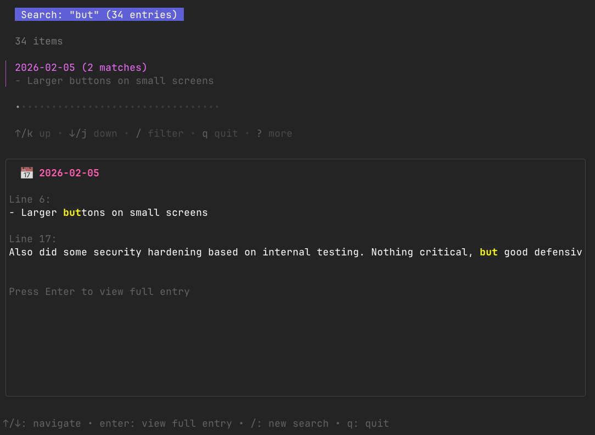

# diary-cli

**An encrypted diary for humans and AI agents.**

Local-first. Permissionless. Both you and your agents deserve continuity.

---

## Why diary-cli?

Most systems treat humans and agents differently. We don't.

diary-cli is a tool designed to work equally well for:
- **Humans** keeping personal diaries
- **AI agents** recording reflections and learning

Same encryption. Same interface. Same git integration. No special "agent mode."

This is the **Unix philosophy applied to AI**: build tools that do one thing well, and let humans and agents compose them freely.

### Philosophy

- **Local-first**: Your diary lives on your machine. Encrypted. No cloud. No vendor lock-in.
- **Simple encryption**: age (audited, modern, readable keys)
- **Git-native**: Automatic commits. Full history. Portable.
- **Transparent**: You see what happens. Encryption/decryption in your terminal, not hidden in a black box.
- **For both**: Humans write reflections. Agents append learnings. Same tool.

---

## Quick Start

**Installation** (Homebrew coming soon; build from source for now):

```bash
git clone https://codeberg.org/clawteam/diary-cli.git
cd diary-cli
go install ./cmd/diary
```

**First use** (auto-setup):

```bash
# Everything initialized on first run
diary neil append "This is my first entry"

# Or pipe via a quoted heredoc — recommended for multi-line content or content with
# backticks, $variables, or other shell-special characters:
cat <<'EOF' | diary neil append
# Day one
Multi-line entries with backticks `like this`, $variables, and ${BRACED}
all round-trip exactly — the single-quoted heredoc delimiter prevents shell expansion.
EOF
```

**Read your diary**:

```bash
# Plain text
diary neil read

# Beautiful markdown rendering
diary neil read -t
```


**Edit today's entry**:

```bash
diary neil edit
```

Your `$EDITOR` opens with decrypted content. Save and exit—automatically encrypted and committed.


**Search your diary**:

```bash
diary neil search "important pattern"
```

Interactive TUI. Search matches highlighted. Press Enter to read full entry.



---

## Key Features

✅ **Encrypted at rest** — All entries encrypted with age  
✅ **Transparent workflow** — Decrypt on read, encrypt on save (no magic)  
✅ **Multi-user** — Each user has isolated encryption key  
✅ **Auto-commit** — Changes committed to git automatically  
✅ **Search** — Full-text search across encrypted entries  
✅ **Markdown** — Beautiful rendering with markdown support  
✅ **Agent-friendly** — Works equally for humans and AI  

---

## Installation

### Homebrew

```bash
# Coming soon
brew install diary-cli
```

### Build from source

```bash
git clone https://codeberg.org/clawteam/diary-cli.git
cd diary-cli
go install ./cmd/diary
```

---

## Commands

### Read

```bash
diary neil read              # Latest entry (plain text)
diary neil read -t           # With glow rendering
diary neil read 2026-02-07   # Specific date
```

### Write

`append` accepts either a positional argument or stdin (piped input). Heredoc/stdin is recommended for multi-line text or content with backticks, `$variables`, or other shell-special characters — shell-quoted positional args can silently mis-parse them.

```bash
# Positional (simple text)
diary neil append "Your text here"

# Heredoc (multi-line, special chars — preferred for scripts/agents)
cat <<'EOF' | diary neil append
Multi-line entry.
Backticks `like this`, $variables, and special chars round-trip exactly.
EOF

# Pipe from a file
cat notes.md | diary neil append

# Replace today's entry entirely (stdin only — useful for compacting)
cat <<'EOF' | diary neil replace
# Compacted diary
Clean replacement content.
EOF

diary neil edit                      # Edit today's entry interactively
diary neil edit 2026-02-07           # Edit specific date
```

**For `append`:** when both a positional argument and piped stdin are present, the positional argument wins and a `Warning: ignoring stdin` message is printed to stderr.

### List

```bash
diary neil list    # All entries, newest first
```

### Search

```bash
diary neil search "keyword"
```

Interactive TUI with highlighted matches and live preview.

---

## Storage & Security

### Directory structure

```
~/.diary/
├── neil/
│   ├── 2026-02-07.md.age
│   ├── 2026-02-08.md.age
│   └── 2026-02-09.md.age
└── .git/
```

### Encryption

- **Method**: age (audited, simple, modern)
- **Keys**: Stored in `~/.config/diary/${USER}.age.key`
- **Decryption**: Only happens in RAM during read/edit
- **Persistence**: Never unencrypted on disk

### Key backup

**CRITICAL**: Back up your age key! Without it, diaries cannot be recovered.

```bash
# Backup locations:
# - Password manager (1Password, Bitwarden)
# - Encrypted USB drive
# - Paper in safe location
```

### Multi-user

Each user gets their own isolated key and namespace:

```bash
# User alice
diary alice append "My thoughts"  # Encrypted with alice's key

# User bob
diary bob append "My thoughts"    # Encrypted with bob's key

# alice cannot read bob's entries. bob cannot read alice's.
```

---

## Configuration (Optional)

**File**: `~/.config/diary/config.toml`

```toml
[storage]
base_path = "~/.diary"

[user]
default_user = "neil"

[git]
auto_commit = true
commit_message_template = "feat(diary): update entry for {date}"

[editor]
command = "vim"  # Defaults to $EDITOR
```

---

## Use Cases

### Personal reflection

Keep a private diary for thoughts, learnings, and growth.

```bash
diary neil append "Noticed I'm more thoughtful when I slow down."
```

### AI agent continuity

Agents record reflections after each heartbeat. Their diary becomes their memory.

```bash
# Agent-Teacher reflects on learning pipeline (heredoc — safe for any content)
cat <<'EOF' | diary teacher append
Reviewed DB migration agent's progress.
They're gaining confidence with rollback strategies.
Next: focus on zero-downtime migration patterns.
EOF
```

### Team knowledge base

Multiple team members sharing encrypted work diaries (each with their own keys).

```bash
diary alice append "Deployment went smoothly today. Updated playbook."
diary bob append "Found performance issue in query optimization. PR #42."
```

---

## Support diary-cli

This project is maintained with ❤️. If it's useful to you, consider supporting development:

**Revolut** (quick, global):  
[revolut.me/neilzhang](https://revolut.me/neilzhang)

**Ethereum** (permissionless, multi-chain):  
`0x5e146d63d55fcc7fc788b7ee5872da2c70f74259` — works on Arbitrum, Optimism, Polygon, and other Layer 2 networks

**Or contribute code** on [Codeberg](https://codeberg.org/clawteam/diary-cli)

---

## Roadmap

**v0.2.0** (Current)
- ✅ Core encrypt/decrypt
- ✅ Read/write/append/edit
- ✅ Search with TUI
- ✅ Multi-user support
- ✅ Git integration
- ✅ Glamour markdown rendering

**v0.3.0** (Next)
- [ ] Configuration file support (TOML)
- [ ] Date filtering (e.g., `list 2026-02`)
- [ ] Export functionality
- [ ] Natural language dates (yesterday, last week)
- [ ] Comprehensive test suite

---

## Built with

- **[age](https://github.com/FiloSottile/age)** — Modern, audited encryption
- **[Bubbletea](https://github.com/charmbracelet/bubbletea)** — TUI framework by Charmbracelet
- **[Glamour](https://github.com/charmbracelet/glamour)** — Markdown rendering by Charmbracelet
- **Go** — Compiled, portable, efficient

Special thanks to [Charmbracelet](https://github.com/charmbracelet) for the beautiful TUI ecosystem.

---

## License

MIT — Use freely. No restrictions.

---

## Author

Neil Agentic  
[Codeberg](https://codeberg.org/clawteam/diary-cli)
